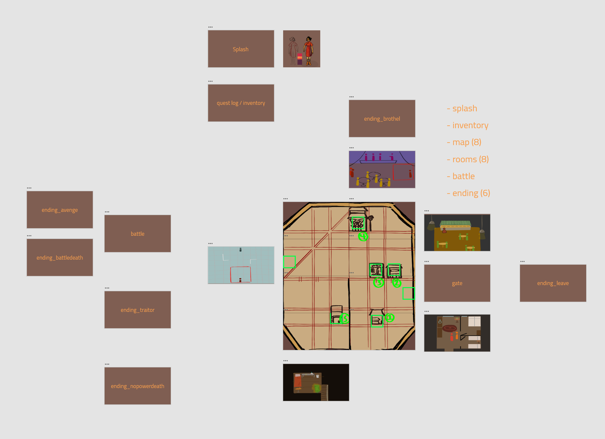

## ART385 Project 2
##### April 20, 2021
by Maj Jenkins

Hosted currently at https://xarts.usfca.edu/~mrjenkins/art385/project2/

### About
Streetlamp is a game which satirizes Orientalist tendencies in physical and fictional environments. By exploring anti-Asian racism within visual and storytelling mediums that bleeds into the real world, it calls attention to the fetishization and sexualization Asian women suffer, in addition to criticizing tired racist tropes and stereotypes which are commonplace in Western media. 

### Overview
This game addresses multiple tired tropes that the Asian community faces in its media representation: 
* obsession with revenge
* obsession with filial piety
* a vague quest for “mythical power"
* hypersexualized and one-dimensional female characters

... as well as real-life issues that the Asian community faces:
* sexual harassment
* sexual exploitation
* model minority myth and desire for assimilation

Through this satirical lens, at times comical and at times dark, these objects of interest are explored in this work.

Within the game itself, the player is Ren, a young woman whose parents have been murdered, and it is up to her to avenge their honor while combating other dark forces within the city of New Chinatown.

### XD Wireframe Link

https://xd.adobe.com/view/28e68961-1ba4-4e09-968f-90a58e149ca3-7db5/

### Technical Details
##### assets
Chinese Dragon Stock Image
* https://www.istockphoto.com/vector/red-paper-cut-a-dragon-china-zodiac-symbols-gm486696720-73307181

##### libraries
This game uses multiple add-on libraries for p5.js.
* p5.clickable by Lartu
* p5.play by Paolo Pedercini / @molleindustria
* p5.timer by Scott Kildall
* p5.adventure manager by Scott Kildall

##### fonts
Changa by Eduardo Tunni
* https://fonts.google.com/specimen/Changa

Cairo by Mohamed Gaber, Multiple Designers
* https://fonts.google.com/specimen/Cairo

Korean Calligraphy by hiJoju
* https://www.dafont.com/korean-calligraphy.font

Osake by StringLabs Creative Studio
* https://www.dafont.com/osake.font

##### sfx
Damage Noise
* Phone Vibrate Sound Effect [Vibration Cell SMS] from Impostor, YouTube, Apr 17, 2016.
* https://www.youtube.com/watch?v=ZtpYOnKEgm4

Button Clicks
* Click Sound Effects (Copyright Free) from 
Creator Assets, YouTube, Aug 19, 2019.
* https://www.youtube.com/watch?v=q8ZLBOFQ2g0

Background Music (currently disabled but exists within the assets folder)
* Memory of Ancient Street, Archive.org
* https://archive.org/details/PrayForEarthquake/Memory+of+Ancient+Street.mp3
* A Maiden's Love
* https://archive.org/details/PrayForEarthquake/A+Maiden's+Love.mp3

#### development
The original Adobe Illustrator and FireAlpaca files from which the assets were created are included in this repository.